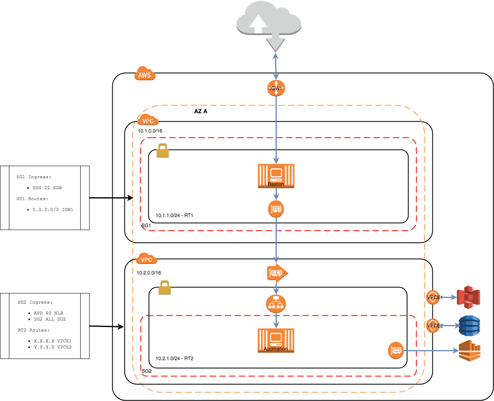

# AWS / Terraform Networks with Private VPC Service Endpoint

This project demonstrates how 2 non-peered fully segregated VPC's are able to communicate using  
VPC Service Endpoints and a VPC Interface Endpoints



The bastion host in this diagram acts as the client for the application hosted in VPC 2 (10.2.0.0).
The application has a very simple HTTPD running on port 80. An NLB is used to front a target group for the application on port 80.
The VPC service endpoint is offering access to this application using a private DNS.
Note that the security group 2 (SG2) has an ingress rule that allows TCP traffic from port 80 for all of the subnet.
The reason for this is that the NLB is not attached to a security group and can take on any IP address in the assigned subnet.

In VPC 1 (10.1.0.0) a VPC endpoint interface has been created to connect to the application.
The endpoint establishes an ENI that has been assigned to the same security group (SG1) as the bastion.

## Set-Up

You will need the following tools and accounts to make it happen

### AWS Account

You will need an AWS account, if you don't have one then just [Sign-Up](https://aws.amazon.com/free)
You will need a development user with admin access and security access keys in order to use the AWS CLI

Install the [AWS CLI](https://aws.amazon.com/cli/) and set-up a profile using your access keys


### SSH Key

You will need to set-up your desired AWS region with a secure key pair.
This project is using London (eu-west-2) as the region I suggest you keep this the same as there are AMI's referenced that are region sensitive.

[EC2 Key Pairs](http://docs.aws.amazon.com/AWSEC2/latest/UserGuide/ec2-key-pairs.html) has instructions on how to set-up your key pair.

Once you have set-up key pair you will have access to the PEM file that needs to be stored safely.
Terraform assumes that the PEM is available in your local key chain, you can add it it to your key-chain by running the following command

```commandline
ssh-add -K your-key.pem
```

### Terraform

Install terraform command line tool. Depends on your OS, [Install Terraform](https://www.terraform.io/intro/getting-started/install.html) has some descent instructions.

If you are using OSX I suggest you use [Homebrew](https://brew.sh/) to install the terraform package.

## Building / Running

### Plan

I suggest that you run a plan to determine that access to your AWS account is as expected.
Run the following command in the root of the terraform source _src/main/terraform_
Note that it is recommended that you override the default values for _aws_profile_ and the _bastion_network_cidr_

```commandline
terraform plan -var "aws_key_name=your-key-name" -var "aws_region=us-east-1"
```

The output of this command will detail all the resources that will be created once applied.
Note that it is recommended that you override the default values for _aws_region_ (eu-west-1), _aws_profile_ (default)
and the _bastion_network_cidr_ (0.0.0.0/0) e.g.

```commandline
terraform plan -var "aws_key_name=you-key" -var "aws_profile=bastion-lab" -var "bastion_network_cidr=199.250.200.0/24"
```

### Apply

Once you are happy with the plan apply and decided on what variables to override you can apply your plan e.g.

```commandline
terraform apply -var "aws_key_name=you-key" -var "aws_profile=bastion-lab" -var "bastion_network_cidr=199.250.200.0/24"
```

### Testing

The best way to test the application is to SSH on to the test host and attempt accessing the internet.

1. SSH to the bastion host - _ssh ~/.ssh/<YOUR_KEY>.pem ec2-user@<BASTION_HOST_IP>_
2. cURL the application using the private DNS name - _curl -I  http://<VPC_ENDPOINT_PRIVATE_DNS>_

Example Output:
```
curl -I http://vpce-058b2372d45e91f4e-9pa4nqob.vpce-svc-0841bfa5bc94b1b7b.eu-west-1.vpce.amazonaws.com
HTTP/1.1 200 OK
Content-Type: text/html
Server: WEBrick/1.3.1 (Ruby/2.0.0/2015-12-16)
Date: Wed, 28 Mar 2018 13:12:40 GMT
Content-Length: 2426
Connection: Keep-Alive
```

### Destroy

Clean up your environment by detroying, this will remove all traces:
```commandline
terraform destroy -var 'aws_key_name=your-key.pem'
```
